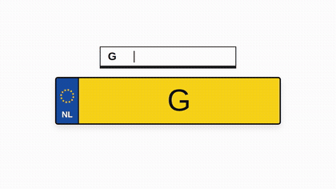

# kenteken-kit

Tiny Dutch kenteken formatting, parsing, and validation for JavaScript,
TypeScript, and Kotlin.

`formatKentekenPartial` formats live input as a Dutch plate while the user types.

<p align="center">
  
</p>

## Packages

| Platform | Package | Docs |
|---|---|---|
| JavaScript / TypeScript | [`kenteken-kit`](https://www.npmjs.com/package/kenteken-kit) | [`docs/npm.md`](./docs/npm.md) |
| Kotlin / JVM | [`io.github.scan-kenteken:kenteken-kit`](https://repo1.maven.org/maven2/io/github/scan-kenteken/kenteken-kit/0.1.0/) | [`kotlin/README.md`](./kotlin/README.md) |

Both implementations share fixtures from [`fixtures/plates.shared.json`](./fixtures/plates.shared.json)
so formatter and validator behavior stays aligned across platforms.

## JavaScript Quick Start

```sh
npm install kenteken-kit
```

```ts
import {
  formatKenteken,
  formatKentekenPartial,
  isKenteken,
  normalizeKenteken,
  parseKenteken,
} from "kenteken-kit";

normalizeKenteken(" kjr-50.s "); // "KJR50S"
formatKenteken("kjr50s"); // "KJR-50-S"
formatKentekenPartial("kjr5"); // "KJR-5"
isKenteken("G-001-BB"); // true

parseKenteken("G-001-BB");
```

## Kotlin Quick Start

```kotlin
import com.github.scankenteken.kit.KentekenKit

val normalized = KentekenKit.normalize(" ss-12.12 ")
val formatted = KentekenKit.format("G001BB")
val partial = KentekenKit.formatPartial("kjr5")
val valid = KentekenKit.isValid("G-001-BB")
```

## Repository Development

Run the JavaScript package checks:

```sh
npm test
```

Run the Kotlin package checks:

```sh
cd kotlin
./gradlew test
```

Check that npm, Maven, and the repo-root `VERSION` file agree:

```sh
npm run version:check
```

## License

MIT
